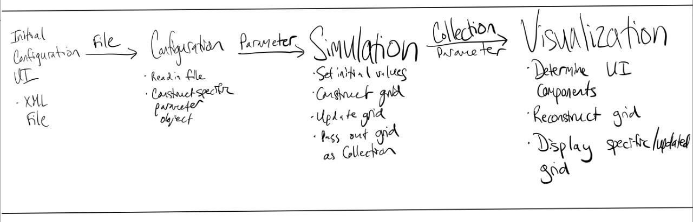
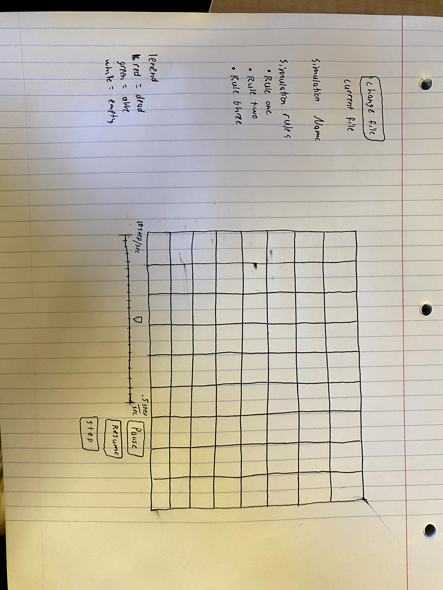

# Simulation Design Plan
### Team Number 07
### Names Dennis Harrsch, Luke Peterson, Muthu Arivoli

## Introduction
The main goal of this project is to design a program that will be able to simulate cellular automata and will be 
able to provide a visualization for such a simulation. The primary design goal of the project is to create a project 
that will be easily extendable to other cellular automata simulations, and that should be able to be easily run from 
various initial configurations. New cellular automata simulations should be easily implementable, and should not 
require any major changes to the existing codebase that we will develop. We will also implement the code in such a 
way that other shapes that cellular automata models use, like hexagons, will be readily implementable, and that it 
should not require many changes to the underlying simulation mechanics. The GUI should also be easily modifiable, 
and new features for the GUI should be easily addable. The already implemented simulations should be closed for 
modification, but new simulations should be able to be implemented, thus leaving the code open for those types of 
modifications. In general, the classes that we write should not need to be edited by much if new features need to 
be added. 

## Overview
Generally speaking, there are three main classes in our design that do the majority of the work, and they mirror the 
three main goals as outlined in the project description. These classes will be a configuration class, simulation class,
and visualization class. These three main classes will operate within a Driver class, which will work as a means of
passing information between the classes when necessary, controlling the time and stepping of each function as 
necessary, and shifting between UI screens. First, the Configuration will take in a general File input, such that it 
could read in any type of file, and that the user need not worry about the specific implementation of the Configuration
class, nor vice versa. The Configuration will then communicate with the Simulation and Visualization classes via a 
Parameter class, which will have several subclasses that extend the main class to enable multiple types of simulations 
to be input and output via the same class. This will help to hide the specific implementation and allow for the 
Simulation and Visualization classes to not take in different outputs from the Configuration class without having to 
alter their structure or code. These Parameter objects will contain the necessary information to set up the initial 
configuration, as well as the visual components that will differ from simulation to simulation. In turn, the 
Simulation class will pass in a Collection to the Visualization class, which will, with help from the Parameter 
object passed from the Configuration class, determine how the Collection represents the grid/simulation. 
By passing in a Collection object, we will be able to utilize various different implementations, such as a 2D
ArrayList or a graph via a HashMap, while still hiding the specifics of the implementation. Either implementation 
will utilize a Cell class as the makeup of the Collection, which include the state of the cell as well as other 
information important to setting up and then changing the grid as the simulation progresses. These five main classes
will do the vast majority of the work, and will communicate with each other in the ways described. There will also be 
some intermediary classes that will initialize the Configuration and Simulation classes, which will set up the initial
UI and then will set up the parameters of the simulation based on the Parameter object respectively, but these are 
essentially extensions of the classes above, and they are only separated for clarity, as well as to further create 
separation between the other classes. The design is expanded upon in the diagrams below.

## User Interface

As shown in the picture above, the interface will have all the features outlined in specification for the project. 
This includes buttons to pause, continue and step through the simulation. It will also have a sliding bar that allows 
the user to change the rate at which the simulation is run. There is also a button to change the loaded file for the 
simulation. Each file will contain rules associated with how the simulation runs. We are assuming that each file the 
user can load will not have any bad formatting and will fit an assumed structure. There is an erroneous error that 
could arise if the user moves to quickly on the sliding bar or stops and continues the game to fast. Other than this 
error, the interface will not contain any bad situations. While the simulation is continuously running, the interface 
interacts with the driver of the simulation to advance and take the next step for the simulation. The same process 
occurs for the step except it happens only once per button push.

## Design Details
In this section we will describe in more specifics the five main classes described above ? Configuration, Simulation, 
Visualization, Parameter, and Driver. The ways in which they generally operate are described in the Overview above, but 
this section will describe some specific jobs of each, as well as important/vital method calls and how they are 
distributed among the classes to enable the solutions to the use cases as described below in the Design Consideration 
sections.

### Driver
The purpose of the Driver class is to act as a space for communication between the various classes doing work to 
perform the simulation, and act as another degree of separation between them. The Driver class will have a step 
function defined in it which will perform the necessary actions in the Simulation and Visualization classes, updating 
first the grid in the simulation and then passing the updated grid as a Collection into the Visualization class. It 
will also be the place that will call the initialize Configuration UI class, into which the Driver will pass in a File. 
The configuration will return the Parameter object, as specified by the input from the file, which will then be passed 
into the Simulation and Visualization classes in order to determine their set up and define some of their functionalities.

### Configuration
The Configuration class will have the job of taking in a File and reading in the type of simulation, as well as the 
initial set up and parameters for the simulation. This will occur in a readFile method, which will in turn pass 
results into a createParameter object. The latter will construct the specific Parameter object that the simulation 
calls for. This Parameter will be an instance variable that can be accessed via a getter method, and in turn sent to 
both the Simulation and Visualization via the Driver class as an abstract Parameter object, even though it will carry 
the specific implementation.

### Parameter
Their will be various types of Parameter objects, each of which corresponds to a different type of simulation. These 
parameter objects will include the necessary states, thresholds, and actions to be taken in a simulation, and will 
also provide the information necessary to describe the specific visualization UI for this simulation, such that there 
are never buttons or tools missing or that cannot be used. This will be a means of protecting from bad user input. 
The general Parameter class will be abstract but will be used as a means of hiding the specific implementation and 
will allow for other classes to not have to be changed if new simulations were to be added. Each Parameter object 
will have specific implementations of methods such as setUI, setThreshold, setStates, or setInitial such that they 
will help to set up the Simulation and Visualization classes.

### Simulation
The purpose of the Simulation class will be to perform the calculations necessary to update and maintain the grid of 
cells during each iteration of the simulation. This will include an updateCell method, which looks at all of a Cells 
neighbors and calls its setState function if the threshold for change is met. It will also have a method that is 
called once that makes the grid based on the input from the Configuration class. This grid will be, in our 
implementation, a graph/HashMap. We considered and discussed a 2D ArrayList, but decided that the way that a graph 
is constructed is more versatile, has less space, and provides an easy, intuitive means of finding and iterating 
through a cell?s neighbors. This grid will be an instance variable that is maintained and able to be accessed. It 
will in turn be passed as a collection into the visualization. The calls to updateCell will operate on a single cell, 
but will be called within an updateGrid method, which iterates over all of the cells and their neighbors, creating a 
new grid/graph as it does so, and replacing the instance variable myGraph after the new graph is completed.

### Cell
The Cell class will be the object that is stored in the grid, and will include several instance variables that are 
crucial to the implementation of the grid, and will be much easier and cleaner than implementing nested ArrayLists or 
some other confusing method. It will include the current and possible states, a means of transitioning states, as 
well as information for how they should be represented in the visualization. A cell could also include information on 
its neighrbors such that it can help reconstruct the grid after the collection is passed into the visualization.

### Visualization
This Visualization class will include components that construct the UI. It will have methods such as setUI based on 
the parameter input and will also handle the input from the user such that it is interactive. These inputs will help 
construct a new Simulation to start, communicating via the Driver class. The Visualization will also reconstruct the 
Collection from the simulation with help from information in the Collection and Cells. This will then be represented 
visually in a manner that depends on the number of cells, type of simulation, and the input from the user in the UI. 
This will include methods such as udpateGrid which changes the current visual on the grid to the new grid created by 
the simulation and passed into the visual, reconstructed from the Collection. Note that taking in a collection will 
allow us to alter the implementation in the simulation without having to similarly change the Visualization class, a 
key design feature that will allow versatility and problem solving where need be. It will also include a means of 
using the Configuration class to essentially restart the process with a new Simulation if the user uploads a new file,
with a method such as handleChangedFile. All in all, the visualization will work closely with the simulation, but 
will hide their implementations from each other and will divvy up the work evenly between them.

## Design Considerations - Muthu

#### Components
One issue that we had was that we did not know how to implement the data structure being used for the simulation. We 
discussed using a 2D array, but determined that it would be difficult to extend to other shapes in the grid like 
hexagons. We then discussed using a graph to represent the simulation, and realized that this would probably be better 
in terms of that it would not rely on the shape of the cells in the grid, and that edge and middle cells can be treated 
the same, they are only differentiated by when we make the graph. 

Another issue we faced was how the simulation would communicate the new states with the visualization. We thought that 
one solution would be that the simulation communicates directly with the visualization, and liked how the direct 
communication would simplify the class structure. We also thought that this might cause some unnecessary coupling 
between the visualization and the simulation. An alternative we came up with was a class that would take care of the 
interactions between the simulation and visualization, with the advantage being that the two components no longer 
directly rely on each other, but with the disadvantage that the code now becomes more convoluted. 
 
#### Use Cases
* For the first use case, a call to updateCell will check the nearest neighbors and call the cell?s setState function if 
necessary (or transitionState). The nearest neighbors will have already been determined when creating the Graph that 
represents the grid in the simulation.
For the second use case, a call to updateCell will check the nearest neighbors and call the cell?s setState function 
* if necessary (or transitionState). The nearest neighbors will have already been determined when creating the Graph 
that represents the grid in the simulation.
* A call to update will create and return a new Graph that nodes will be added to that correspond to the existing graph 
in the next state. This graph will then be converted to a collection (internally) that will then be passed to the GUI 
that will parse the collection and call display on the collection.
* The program will first call a function that reads in the XML file and saves that to a Parameter object. The driver 
program will then call a method that will be able to set the simulation parameter appropriately.  
* The program will first call a function that reads in the XML file and saves that to a Parameter object. The driver 
program will then call a method that will create a new Wator Simulation with the input as this Parameter object.

## Team Responsibilities

* Team Member #1
Dennis will primarily work on the Configuration and Parameter classes, with secondary responsibilities on the Simulation,
helping Muthu where necessary. At a high level, the plan is to implement the Configuration so as to handle multiple types
of files, and utilize the type of file to build a specific Parameter object that will pass as much information as 
possible specific to this file into both the Simulation and Visualization classes, to enable them to be initialized 
and continued easily. It will also reset the UI when a new file is uploaded; The Parameter class will have several 
generic, abstract methods that will be implemented specifically with a Parameter object for each type of 
implementation, such as WatorParam, FireParam, SegregationParam, etc. These methods will include setUI, setThreshold,
setStates, etc.

* Team Member #2
Muthu will be primarily responsible for the Simulation class, with secondary responsibilities on the Visualization 
classes. At a high level, the Simulation will consist mainly of maintaining, constructing, and updating the grid of 
cells, represented as a graph of Cell objects. This will utilize a Parameter object to set initial values, and then 
will apply those values to functions defined in the aforementioned classes to make necessary changes.

* Team Member #3
Luke?s primary responsibility will be the Visualization class, with secondary responsibilities with the Configuration 
class. The Visualization will take in the Parameter object in order to define UI components, and then will utilize the 
Parameter object, input, and Collection passed in from the Simulation to update the grid that is being presented on the
GUI with each step from the Driver function.

